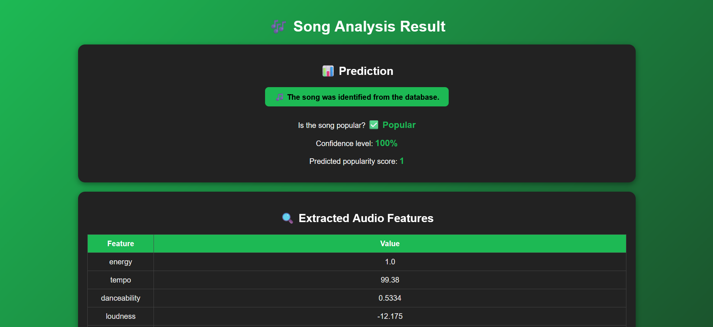
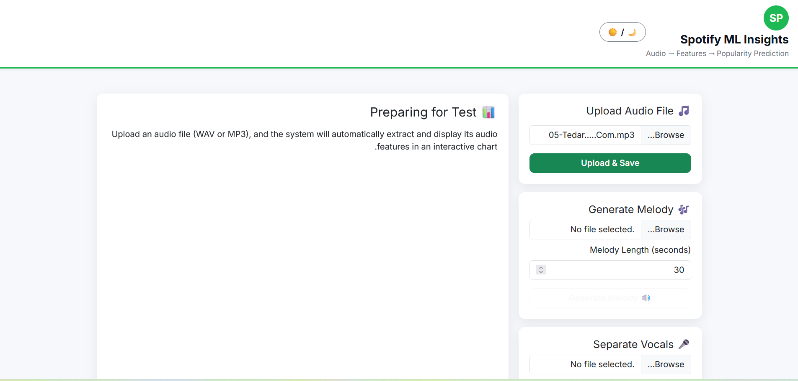
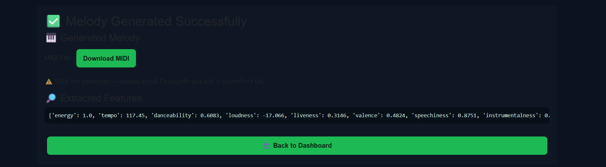
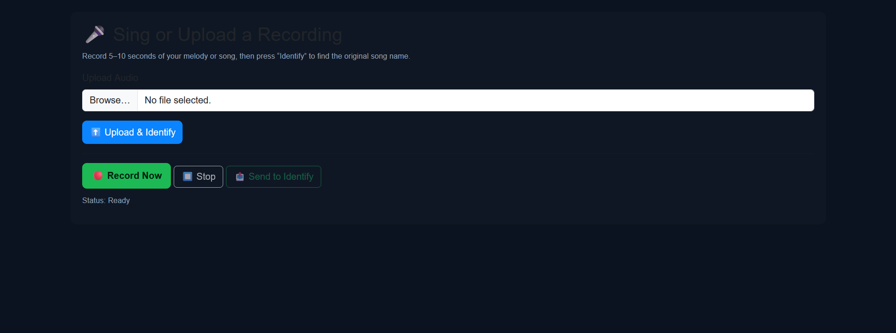

# 🎧 Music Identifier AI



## ⚙️ Overview
**Music Identifier AI** is an intelligent web-based system that can analyze uploaded songs, extract their musical features, and predict whether the song is popular or not using a trained machine learning model.  
The app also provides a retraining system, allowing the model to learn from new uploaded songs and continuously improve.

---

## 🚀 Features
✅ Upload Songs — Supports `.mp3` and `.wav` formats.  
🎵 Automatic Feature Extraction — Extracts tempo, spectral features, chroma, MFCCs, and more.  
📈 Popularity Prediction — Uses a trained model to predict if a song is likely to be popular.  
🔁 Model Retraining — Add new songs and retrain the model on the fly.  
📊 Accuracy Display — Shows updated accuracy after retraining.  
🎨 Modern Interface — Built with Bootstrap 5 and RTL support.  

---

## 🧠 How It Works
1. The user uploads a song via the main dashboard.  
2. The system extracts relevant audio features using Librosa.  
3. These features are passed to a Machine Learning model trained on labeled data.  
4. The model outputs whether the song is popular (1) or not popular (0).  
5. Users can add new songs to the archive and trigger retraining to improve performance.  

---

## 🛠️ Tech Stack
| Component | Technology |
|------------|-------------|
| **Backend** | Flask (Python) |
| **Frontend** | HTML, CSS, Bootstrap 5 |
| **Audio Processing** | Librosa, NumPy |
| **Model** | Scikit-learn |
| **Database/Storage** | Local CSV or folder-based archive |
| **Interface Language** | English |

---

## 💻 Installation
1. Clone this repository:
   ```bash
   git clone https://github.com/YOUR_USERNAME/music-identifier-ai.git
   cd music-identifier-ai
   ```

2. (Optional) Create a virtual environment:
   ```bash
   python -m venv music
   source music/bin/activate   # On Windows: music\Scripts\activate
   ```

3. Install dependencies:
   ```bash
   pip install -r requirements.txt
   ```

4. Run the Flask app:
   ```bash
   python app.py
   ```

5. Open your browser and visit:
   ```
   http://127.0.0.1:5000/
   ```

---

## 🧩 Project Structure
```
music-identifier-ai/
│
├── app.py                   # Main Flask application
├── static/
│   ├── images/
│   │   ├── banner.png
│   │   ├── Dashboard1.png
│   │   ├── generate_result.png
│   │   └── Identify_music.png
│   └── generated/           # Folder for generated outputs
│
├── templates/
│   ├── index.html           # Main dashboard
│   ├── retrain_result.html  # Retraining results page
│   └── add_song.html        # Add song form
│
├── model.pkl                # Trained ML model
├── retrain.py               # Retraining logic
├── feature_extraction.py    # Feature extraction utilities
├── requirements.txt
├── .gitignore
└── README.md
```

---

## 🖼️ Screenshots

| Main Dashboard | Retraining Result | Add Song Form |
|----------------|------------------|----------------|
|  |  |  |

---

## 🔮 Future Improvements
- Add a deep learning model (CNN or LSTM) for feature learning.  
- Build a user login system to save user-specific song histories.  
- Add visualizations for audio features (waveforms, spectrograms).  
- Deploy online via Render or Hugging Face Spaces.  

---

## 👨‍💻 Author
**Abdelrhman Ahmed**  
💡 AI Engineer & Developer  
📫 [GitHub Profile](https://github.com/AbdoAhmed666)  
🌍 Cairo, Egypt  

---

## 🧾 License
This project is licensed under the MIT License — feel free to use, modify, and share it freely.

---

## ⭐ Contribute
If you like this project, please ⭐ star the repo and contribute by improving the retraining logic or UI design.
